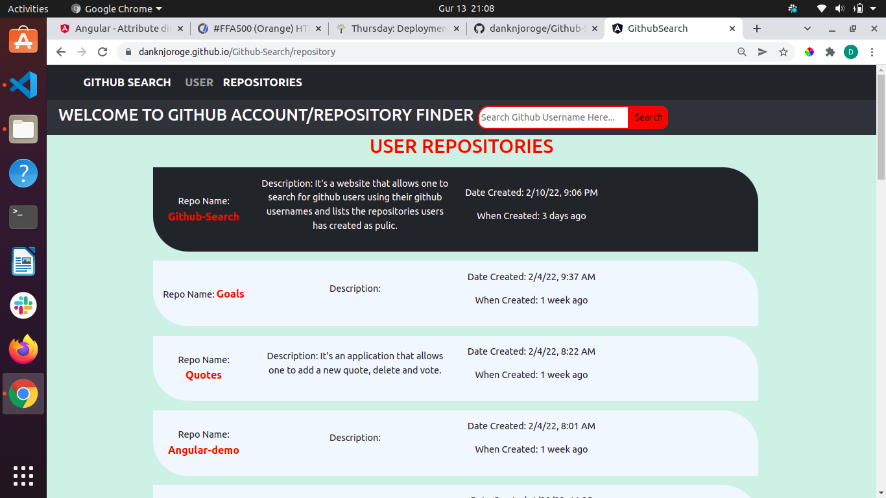

# GithubSearch
## By Daniel Njoroge

## Description
It's a site that allows one to be able to search for users using their usernames using an API. One is able to see all the repositories related to them ass well as the day they were created.

# Screenshots of interface

## Installation And Setup Requirements
* Have a computer connected to the internet with browser and code editor installed.
* Open Terminal in your computer
* Clone the repository to your machine from https://github.com/danknjoroge/Github-Search.git
* Open application using code editor of your choice preferrably atom or visual studio.
* Run ng serve --open to run application withand opens on your browser.
* Alternatively, you can use the live link provided under the live-link section which only requires network connection and computer with any browser.

## Live link
https://danknjoroge.github.io/Github-Search/user

## Technologies and Software Used
* HTML
* CSS
* Bootstrap
* Typescript
* Visual Studio Code

## Known Issues and Bugs
The project itakes a while to load the information.

## Support And Contact Information
For any Querries and support you can reach me via my email address:
* dank8505@gmail.com

## License
This project is under [MIT](LICENSE)
